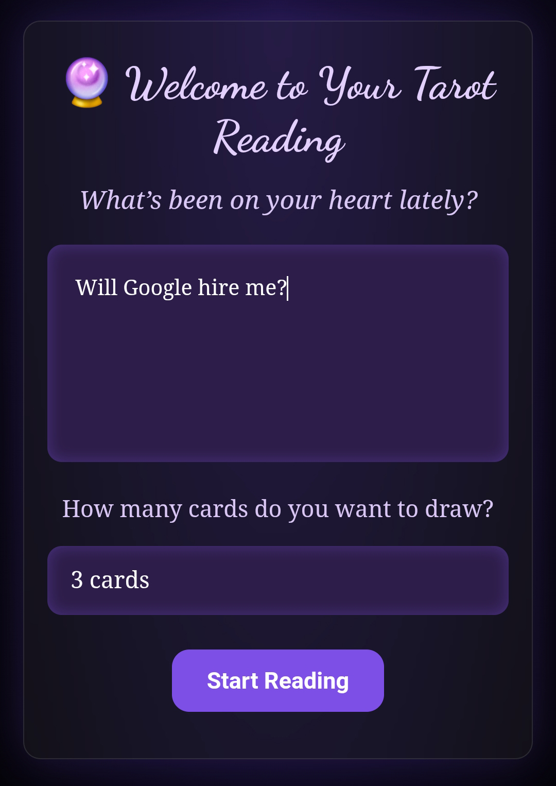
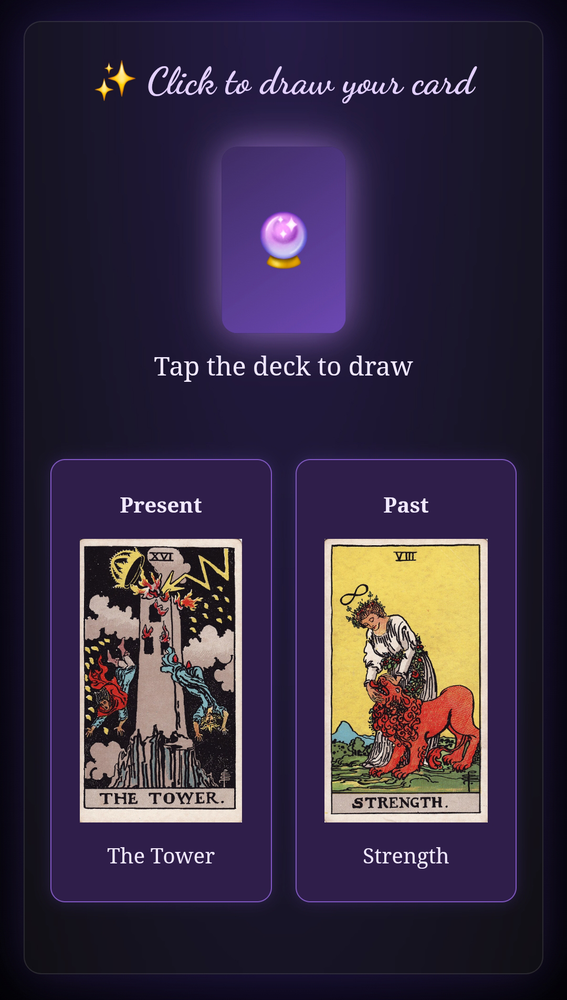
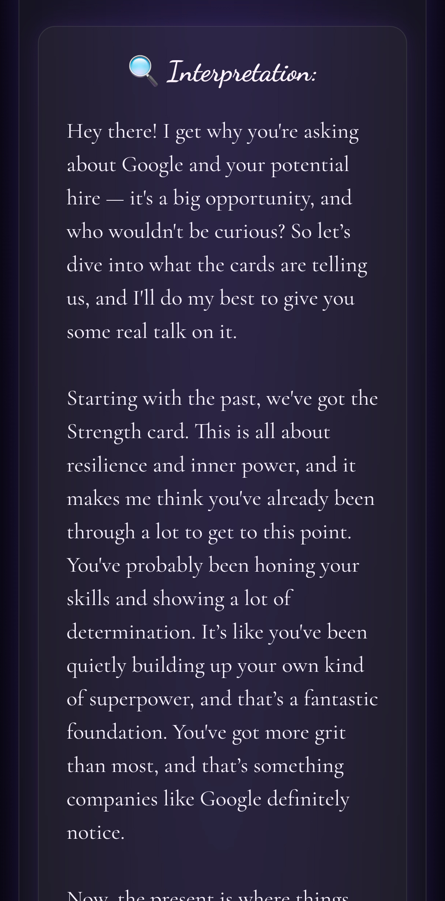

# 🔮 Virtual Tarot AI

A modern tarot web app powered by GROQ’s LLaMA 3 API. The user draws 3 to 10 cards, asks a personal question, and receives a thoughtful interpretation from an AI acting as an intuitive, empathetic tarot reader.

This project combines traditional tarot symbolism with AI reasoning using LLaMA 3 via GROQ, FastAPI, and LangChain. Originally built with OpenAI, it now runs on GROQ for its excellent performance and free access.

---

## ✨ Features

- Interactive tarot deck with 78 cards (Major & Minor Arcana)
- Custom spreads: 3, 5, 7 or 10 cards (Past/Present/Future, etc.)
- User writes a personal question
- AI interprets the reading in a conversational, grounded tone
- Responsive UI (React) + scroll animations
- Full-stack integration via API (FastAPI backend)

---

## 🛠️ Tech Stack

| Frontend            | Backend                  | AI / LLM Stack       | Deployment          |
|---------------------|---------------------------|----------------------|---------------------|
| React (Vite)        | FastAPI (Python)          | OpenAI (GPT-4o)      | Vercel (frontend)   |
| CSS Modules         | Pydantic, CORS            | LangChain            | Render (backend)    |
| useState/useEffect  | LLMChain + PromptTemplate | Custom prompt design | .env + CORS config  |

---

## 📸 Screenshots

<div align="center">
  
  
  
</div>

---

## 🧠 How it Works

1. User types a question and selects the number of cards
2. Cards are drawn randomly from the full tarot deck
3. Each card is mapped to a position (e.g. Present, Challenge, Outcome)
4. A custom prompt is sent to OpenAI’s GPT-4o via LangChain
5. The AI returns a natural, human-like interpretation

**Prompt tone:** grounded, empathetic, conversational — avoids mystical clichés

---

## ▶️ Live Demo

🖥️ [https://virtual-tarot.vercel.app](https://virtualtarot.vercel.app)  
🧠 Backend: [https://taro-backend-2k9m.onrender.com](https://taro-backend-2k9m.onrender.com)

---

## 📁 Local Setup

### 🔧 Backend

```bash
cd backend
python -m venv venv
source venv/bin/activate  # or venv\Scripts\activate no Windows
pip install -r requirements.txt
uvicorn main:app --reload
